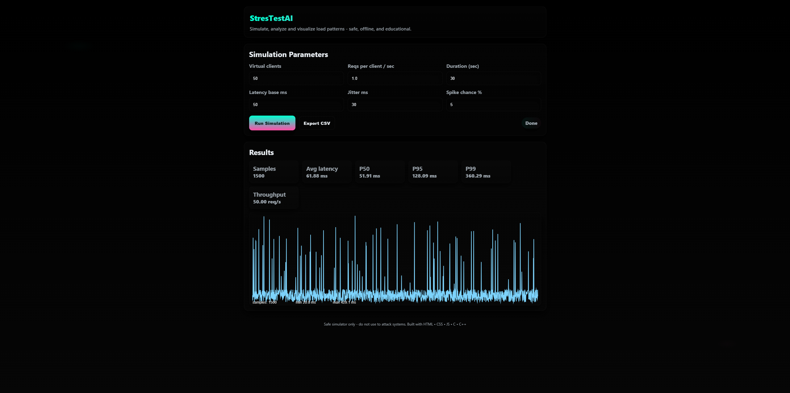

# TestAI

**TestAI** is a hybrid project that combines **HTML, CSS, JavaScript, C, and C++** to simulate and visualize stress-testing scenarios with AI-like behavior.  
The system uses a web interface (frontend) and native modules (backend) to perform CPU-intensive computations, Monte Carlo simulations, and random distributions.  

---

## ScreenShot


## 🚀 Features

- 🌐 **Web UI** built with HTML + CSS + JavaScript
  - Clean, responsive design
  - Live visualization of test runs
  - User controls for simulation parameters

- ⚙️ **C module**
  - Implements random number generation
  - Provides lightweight stress-testing loops
  - Optimized for performance and compiled to WebAssembly (optional)

- 💻 **C++ module**
  - Handles advanced statistical operations
  - Provides AI-like “decision logic” for stress scenarios
  - Works as the computational backend

- 📊 **Simulation tools**
  - Normal distribution sampling (`normal01`)
  - CPU stress routines
  - Monte Carlo-based test evaluation

---

## 📂 Project Structure

TestAI/
│── index.html # Main web interface
│── style.css # UI styling
│── main.js # Frontend logic and WASM bridge
│── simulator.c # Stress test + RNG in C
│── engine.cpp # AI-like simulation engine in C++
│── README.md # Project documentation

---

## 🛠️ How It Works

1. **Frontend (HTML+CSS+JS)**  
   Users set parameters for test intensity and simulation duration in the web UI.

2. **Backend (C + C++)**  
   - `simulator.c` provides random number generation and base stress-test functions.  
   - `engine.cpp` runs higher-level decision-making and extended calculations.

3. **Bridge (WebAssembly or native run)**  
   - C/C++ code can be compiled to WebAssembly for browser execution.  
   - Alternatively, they can run as native binaries and communicate via the JavaScript bridge.

---

## ⚡ Installation & Usage

### Option 1: Run in Browser (WebAssembly)
1. Compile `simulator.c` and `engine.cpp` to WASM using Emscripten:
   ```bash
   emcc simulator.c engine.cpp -o testai.js -s EXPORTED_FUNCTIONS='["_runSimulation"]'
Open index.html in a browser.

Start simulations from the UI.

Option 2: Run Natively
Compile the project with GCC/Clang

📜 License
MIT License © 2025

You are free to use, modify, and distribute this project with attribution.
